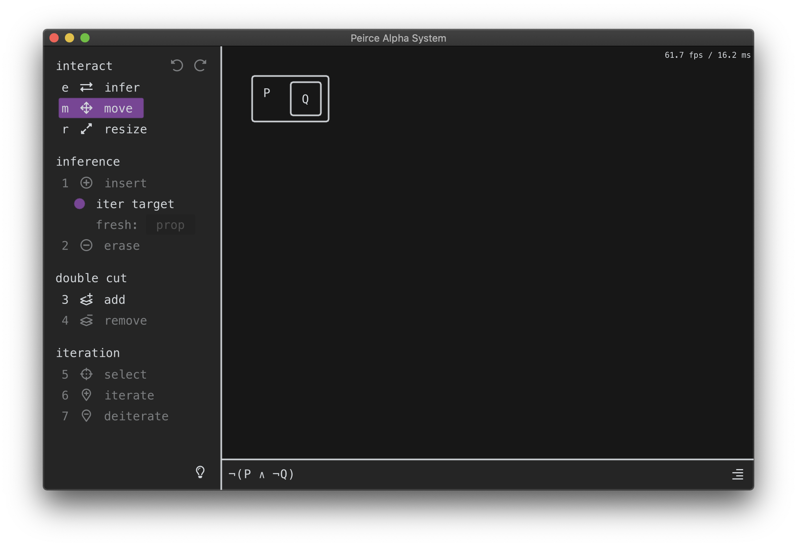

# peirce's alpha system (graphical proof assistant)

Not a very catchy name I know. At least it looks nice:

### what

A graphical proof assistant for [Peirce's Alpha system](https://en.wikipedia.org/wiki/Existential_graph). Supports
the equivalence and inference rules.

### how

Depends on system SDL2; other dependencies are distributed as source. Build with GNU Make.

### license

- [ImGui](https://github.com/ocornut/imgui) is licensed under the MIT license.
- [utf8proc](https://juliastrings.github.io/utf8proc/) is licensed under the MIT license.
- [zpr and zbuf](https://github.com/zhiayang/ztl) are licensed under the Apache 2.0 license.
